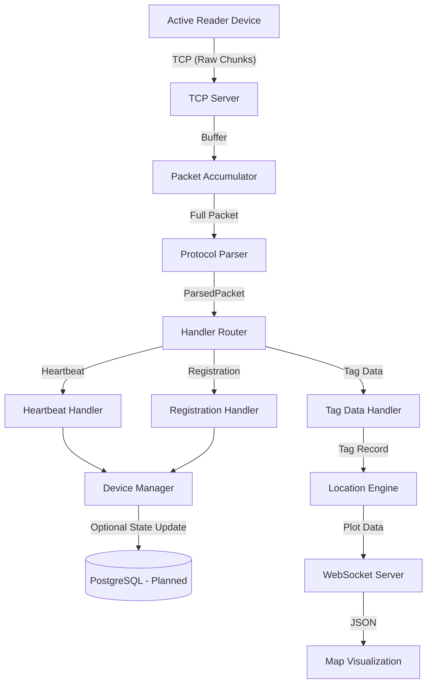

# Architecture: Active Reader Tracker Backend

This document describes the internal structure and data flow of the backend, designed to help developers and AI agents understand how components interact.

## Data Flow Diagram

## Component Responsibilities

### 1. TCP Layer (`/src/tcp`)
- **Server**: Manages low-level sockets.
- **Connection**: Uses `PacketAccumulator` to handle TCP stream fragmentation. It ensures that only complete packets are passed to the parser.

### 2. Protocol Layer (`/src/protocol`)
- **Parser**: Extracts fields from the binary header. Validates the start flag (0x55AA) and CRC16.
- **TLV**: Decodes the "Type-Length-Value" fields inside tag reports. This is where RSSI, Antenna ID, and Tag ID are extracted.

### 3. Handler Layer (`/src/handlers`)
- **Router**: Dispatches packets to specific handlers based on the `cmd` byte.
- **Handlers**: Perform business logic. For example, the `tagHandler` extracts tag information and sends it to the location engine.

### 4. State Machine (`/src/statemachine`)
- **DeviceManager**: Maintains the "Source of Truth" for which readers are currently connected and their health status. It prevents processing data from unregistered or unauthorized devices.

### 5. Location Engine (Planned)
- Processes `TagRecord` objects to calculate (x, y) coordinates or zone-based locations.
- Inputs: RSSI, Antenna Channel, Reader ID.
- Outputs: Normalized location data for the frontend.

## AI Development Guidelines
- **Adding new commands**: Add the command ID to `src/protocol/constants.ts`, update `src/protocol/types.ts`, and create a new handler in `src/handlers`.
- **Modifying TLV**: TLV logic is centralized in `src/protocol/tlv.ts`.
- **Testing**: Use the `__tests__` directory in each module. Mock `net.Socket` for TCP tests.
